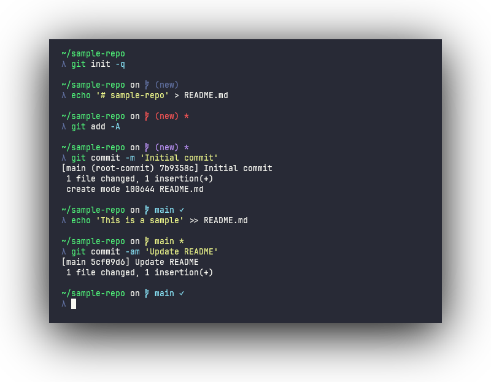

# zcmder

A `zsh` theme inspired by [Cmder](https://cmder.app/) with some additional `git` related prompt features.

<p align="center"></p>

## Installation

### Oh My Zsh

Clone this repository into your `.oh-my-zsh/custom/themes` directory:

```sh
git clone https://github.com/bwpge/zcmder "${ZSH_CUSTOM:-$HOME/.oh-my-zsh/custom}/themes/zcmder"
```

Set the theme in your `.zshrc`:

```sh
ZSH_THEME=zcmder/zcmder
```

### Manual

Clone this repository to your machine (e.g., `~/.zsh`):

```sh
git clone https://github.com/bwpge/zcmder ~/.zsh/zcmder
```

Source the theme in your `.zshrc`:

```sh
source ~/.zsh/zcmder/zcmder.zsh-theme
```

## Updating

To update, pull any new commits from this repository:

```sh
cd "${ZSH_CUSTOM:-$HOME/.oh-my-zsh/custom}/themes/zcmder" && git pull
```

Be sure to reload (e.g., `omz reload`) or source the new file (e.g., `source zcmder.zsh-theme`) for any active sessions.

## Configuration

Environment variables used by this theme are always prefixed with `ZCMDER_`. This theme uses following associative arrays:

- [`ZCMDER_COMPONENTS`](#zcmder_components)
- [`ZCMDER_STYLES`](#zcmder_styles)
- [`ZCMDER_OPTIONS`](#zcmder_options)
- [`ZCMDER_STRINGS`](#zcmder_strings)

When the theme is sourced, these variables are reset to ensure proper declaration and initial values. To customize them, set your desired values *after* sourcing the theme (or `oh-my-zsh.sh`).

Example `.zshrc`:

```sh
ZSH_THEME=zcmder/zcmder
source $ZSH/oh-my-zsh.sh

# zcmder options
ZCMDER_STYLES[cwd]="fg=green,underline" # use green fg and underline effect on cwd
ZCMDER_STYLES[git_branch_default]='fg=blue'  # use blue for default git branch color
ZCMDER_STYLES[git_new_repo]='bg=#2277ff,standout'  # use RGB value for new repo bg color
ZCMDER_COMPONENTS[python_env]=false  # disable python env component
ZCMDER_STRINGS[git_separator]=''  # don't print 'on ' before git prompt
ZCMDER_STRINGS[git_prefix]='■ '  # use different branch icon
```

The following tables explains each option and usage.

### `ZCMDER_COMPONENTS`

Controls which components or segments of the prompt are printed. These values are evaluated with [arithmetic evaluation](https://zsh.sourceforge.io/Doc/Release/Arithmetic-Evaluation.html) (e.g., `(( $foo ))`), so to disable a component set the value to `0`. To enable it, use a non-zero value:

```sh
ZCMDER_COMPONENTS[git_status]=0  # disable git prompt
ZCMDER_COMPONENTS[username]=1    # enable username
```

| Key | Type | Usage |
| --- | ---- | ----- |
| `cwd` | bool | Print the current working directory in the prompt |
| `git_status` | bool | Print a git status (if in a git repo) in the prompt |
| `hostname` | bool | Print the hostname (zsh expanded `%M`) in the prompt |
| `python_env` | bool | Print the current python environment (`conda`or `venv`) in the prompt |
| `username` | bool | Print the username (zsh expanded `%n`) in the prompt |

### `ZCMDER_STYLES`

Controls colors and text effects of the various items in the prompt.

This associative array uses very similar syntax as "types of highlighting" in [`zshzle(1)`](https://zsh.sourceforge.io/Doc/Release/Zsh-Line-Editor.html#Character-Highlighting):

- Values must be a string
- Tokens are separated by commas (without leading or trailing spaces)

Valid style tokens:

- `fg=<color>`: see below for color formats
- `bg=<color>`: same as `fg`
- `bold`: render bold or "intense" text (some terminals render this with "bright" colors and no font weight)
- `dim`: render faint text (some terminals treat this as bold)
- `italic`: render italicized text (some terminals treat this as inverse or blink effect)
- `underline`: render underlined text
- `standout`: uses zsh's `%S` prompt expansion for the terminal's standout mode, typically "reverse video" (see `invert`)
- `invert`: explicitly writes `\x1b[7m` for reverse video (not supported by all terminals)
    - Note: prefer using `standout`
    - If both `standout` and `invert` are specified in a style, `invert` is ignored

Valid colors have the following form (see [`fg` section of *Character Highlighting* in `zshzle(1)`](https://zsh.sourceforge.io/Doc/Release/Zsh-Line-Editor.html#Character-Highlighting) for more information):

- Common name (`black`, `red`, `green`, `yellow`, `blue`, `magenta`, `cyan` and `white`)
- 256-color integer value (e.g., `8` for "bright black" or `142` for `Gold3`, see [this reference](https://ss64.com/bash/syntax-colors.html))
- Hex RGB string `#RRGGBB`

Example usage:

```sh
# green and bold text, inverted (green/default-bg swapped)
ZCMDER_STYLES[cwd]='fg=2,bold,standout'
# white on black in italic/underline
ZCMDER_STYLES[cwd]='fg=#ffffff,bg=#000000,italic,underline'
```

Git status styles have the following priority:

- `git_staged`
- `git_unmerged`
- `git_untracked`
- `git_modified`
- `git_repo_new`
- `git_branch_default`

| Key | Type | Usage |
| --- | ---- | ----- |
| `caret` | style | Default caret style |
| `caret_error` | style | Caret style when the last exit code was non-zero |
| `cwd` | style | style of the current working directory |
| `cwd_readonly` | style | style when the current working directory is read-only |
| `git_branch_default` | style | Default git status style |
| `git_modified` | style | Git status style when only tracked files are modified |
| `git_new_repo` | style | Git status style when in a new repository |
| `git_staged` | style | Git status style when all local changes are staged |
| `git_unmerged` | style | Git status when there are unmerged changes |
| `git_untracked` | style | Git status when untracked (dirty) files are present |
| `python_env` | style | The style for current python environment name |
| `user_and_host` | style | style for both username and hostname components |

### `ZCMDER_OPTIONS`

Controls general behavior of the prompt.

| Key | Type | Usage |
| --- | ---- | ----- |
| `git_show_remote` | bool | Show the remote with git status (e.g., `main:origin/main`) |
| `newline_before_prompt` | bool | Print an empty line before the next prompt (excluding the first prompt) |

### `ZCMDER_STRINGS`

Controls values or tokens in each component that are printed.

| Key | Type | Usage |
| --- | ---- | ----- |
|`caret`| string | Prompt string (the value printed directly before user input area) |
|`caret_root`| string | Prompt string when running with elevated permissions |
|`git_ahead_postfix`| string | Printed when repo is ahead of upstream (initialized with `$ZSH_THEME_GIT_PROMPT_AHEAD`) |
|`git_behind_postfix`| string | Printed when repo is behind upstream (initialized with `$ZSH_THEME_GIT_PROMPT_BEHIND`) |
|`git_clean_postfix`| string | Printed when repo has no local changes (initialized with `$ZSH_THEME_GIT_PROMPT_CLEAN`) |
|`git_dirty_postfix`| string | Printed when repo contains unstaged changes (initialized with `$ZSH_THEME_GIT_PROMPT_DIRTY`) |
|`git_diverged_postfix`| string | Printed when repo is both ahead and behind (diverged from) upstream (initialized with `$ZSH_THEME_GIT_PROMPT_DIVERGED`) |
|`git_label_new`| string | Label to use for a new repository |
|`git_prefix`| string | Prefix always printed for git status e.g., a branch icon or `git(` (initialized with `$ZSH_THEME_GIT_PROMPT_PREFIX`) |
|`git_separator`| string | A separator or preamble before the git status is printed e.g., `' on '` |
|`git_stashed_modifier`| string | Printed when repo contains stashes (initialized with `$ZSH_THEME_GIT_PROMPT_STASHED`) |
|`git_suffix`| string | Suffix always printed for git status e.g., `)` (initialized with `$ZSH_THEME_GIT_PROMPT_SUFFIX`) |
|`readonly_prefix`| string | Printed before current working directory when read-only (see `man test`, `-w` flag) |

### Prevent Modifying `ZSH_THEME_GIT_PROMPT_*`

By default, this theme will set/change several `ZSH_THEME_GIT_PROMPT_*` environment variables since `ZCMDER_STRINGS` initializes values from these variables. Changes to these variables will persist through `omz reload`, so this behavior may not be desireable.

To disable this behavior, set `ZCMDER_NO_MODIFY_ZSH_THEME` prior to loading `oh-my-zsh` or sourcing the theme.

Example `.zshrc`:

```sh
# ...

ZSH_THEME=zcmder/zcmder
ZCMDER_NO_MODIFY_ZSH_THEME=1
source $ZSH/oh-my-zsh.sh

# ... zcmder config
```

To use the `zcmder` git status style without modifying `ZSH_THEME_GIT_PROMPT_*` variables, use the following options after sourcing this theme:

```sh
ZSH_THEME=zcmder/zcmder
ZCMDER_NO_MODIFY_ZSH_THEME=1
source $ZSH/oh-my-zsh.sh

# zcmder config
ZCMDER_STRINGS[git_ahead_postfix]=" ↑"
ZCMDER_STRINGS[git_behind_postfix]=" ↓"
ZCMDER_STRINGS[git_clean_postfix]=" ✓"
ZCMDER_STRINGS[git_dirty_postfix]=" *"
ZCMDER_STRINGS[git_diverged_postfix]=" ↑↓"
ZCMDER_STRINGS[git_prefix]=" "
ZCMDER_STRINGS[git_stashed_modifier]=" ⚑"
ZCMDER_STRINGS[git_suffix]=""
```
