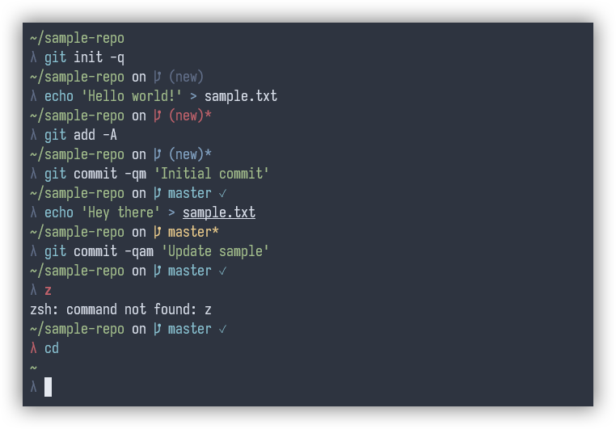

# zcmder

A `zsh` theme inspired by [Cmder](https://cmder.app/) with some additional `git` related prompt features.

<p align="center"></p>

## Installation

### Oh My Zsh

Clone this repository into your `.oh-my-zsh/custom/themes` directory:

```sh
git clone https://github.com/bwpge/zcmder "${ZSH_CUSTOM:-$HOME/.oh-my-zsh/custom}/themes/zcmder"
```

Set the theme in your `.zshrc`:

```sh
ZSH_THEME=zcmder/zcmder
```

### Manual

Clone this repository to your machine (e.g., `~/.zsh`):

```sh
git clone https://github.com/bwpge/zcmder ~/.zsh/zcmder
```

Source the theme in your `.zshrc`:

```sh
source ~/.zsh/zcmder/zcmder.zsh-theme
```

## Updating

To update, pull any new commits from this repository:

```sh
cd "${ZSH_CUSTOM:-$HOME/.oh-my-zsh/custom}/themes/zcmder" && git pull
```

Be sure to reload (e.g., `omz reload`) or source the new file (e.g., `source zcmder.zsh-theme`) for any active sessions.
